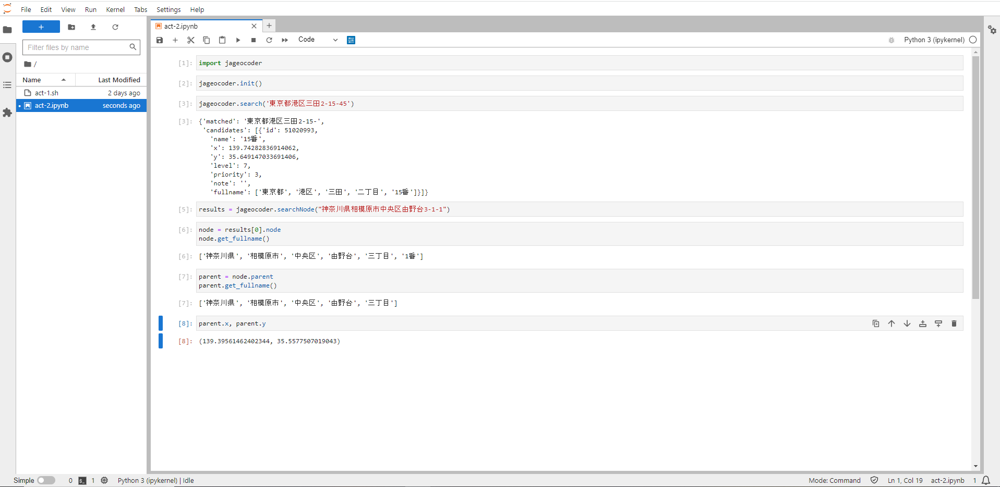

# GISELLE
### Geographical Intelligence of Standing and Eternal Love Lyrics Enchantment
確かに，ジゼルはアルブレヒトを愛していたと思う．
でも，同様に，アルブレヒトもジゼルを愛していたんじゃないかな．  
だから，ジゼルはウィリに許しを願った「アルブレヒトが，死ぬまで私を思い続けることが彼の責任だから」と，そして「猶も，アルブレヒトをただ見守ってるだけでも幸せ」という純粋すぎたジゼルの永遠の愛の叙情詩か，あるいは呪か…  
そんな物語をモチーフにしたものです．  

だからかな，書かれていることに嘘はないが，完結もしていない．  
…なんちゃって

### USAGE
- act-2

License
=======
### Released under the MIT license
##### Copyright (c) 2023 Shoichi Otomo [@geojackass](https://geojackass.com/)

- read under the MIT LICENSE  
[Open Source Initiative](http://opensource.org/licenses/mit-license.php)  

Permission is hereby granted, free of charge, to any person obtaining a copy of this software and associated documentation files (the "Software"), to deal in the Software without restriction, including without limitation the rights to use, copy, modify, merge, publish, distribute, sublicense, and/or sell copies of the Software, and to permit persons to whom the Software is furnished to do so, subject to the following conditions:  

The above copyright notice and this permission notice shall be included in all copies or substantial portions of the Software.  

THE SOFTWARE IS PROVIDED "AS IS", WITHOUT WARRANTY OF ANY KIND, EXPRESS OR IMPLIED, INCLUDING BUT NOT LIMITED TO THE WARRANTIES OF MERCHANTABILITY, FITNESS FOR A PARTICULAR PURPOSE AND NONINFRINGEMENT. IN NO EVENT SHALL THE AUTHORS OR COPYRIGHT HOLDERS BE LIABLE FOR ANY CLAIM, DAMAGES OR OTHER LIABILITY, WHETHER IN AN ACTION OF CONTRACT, TORT OR OTHERWISE, ARISING FROM, OUT OF OR IN CONNECTION WITH THE SOFTWARE OR THE USE OR OTHER DEALINGS IN THE SOFTWARE.

##### jageocoder origin-destination
- https://github.com/t-sagara/jageocoder
